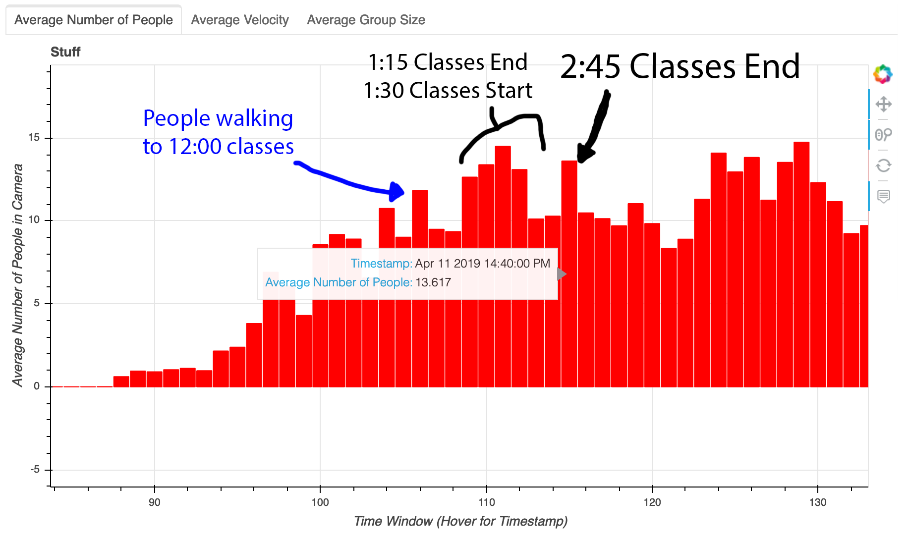

Here are some visualizations of what the detections look like.

## Plaza Metrics

### Average Number of People in the Plaza

Ever wonder when people are around the plaza the most?
We're able to see when people start moving around the square, and how many
people are moving at any point in time.
We count the number of people in the square at any point in time.
For example, here is a bar chart for the average number of people in the plaza,
while aggregating with a window of 20 minutes for Thursday, April 11.
We are able to see from the aggregated analytics when classes finish.

If you want to explore a subset of the data yourself,
check out this interactive graph.
There are a few icons on the right side of the graph for the controls.
When every control is toggled, you can use your scroll wheel to zoom in
or zoom out, and click and drag to move the graph around.
Furthermore, you can get a detailed timestamp and information by hovering
over the individual bars.

<iframe src="interactive_analytics_graph.html"
        sandbox="allow-same-origin allow-scripts"
        width="900"
        height="550"
        scrolling="no"
        seamless="seamless"
        frameborder="0" style="display: block; margin-left: auto; margin-right: auto; width: 500">
</iframe>

## Hotspots

How does the distribution of people in the plaza change over time?
Check out the heatmap of where people are standing in the image here.

<link rel="stylesheet" href="https://cdn.pydata.org/bokeh/release/bokeh-0.12.3.min.css" type="text/css" />
        

<iframe src="locations.html"
        sandbox="allow-same-origin allow-scripts"
        width="500"
        height="550"
        scrolling="no"
        seamless="seamless"
        frameborder="0" style="display: block; margin-left: auto; margin-right: auto; width: 500">
</iframe>

## Looking at the Detections

It's also nice to be able to look at the detections themselves.
We are able to get the detections and plot different classes to check if the
detections are reasonable.

<iframe width="560" height="315" src="https://www.youtube.com/embed/eN9tTVJ9J2c" frameborder="0" allow="accelerometer; autoplay; encrypted-media; gyroscope; picture-in-picture" allowfullscreen class="youtube"></iframe>

